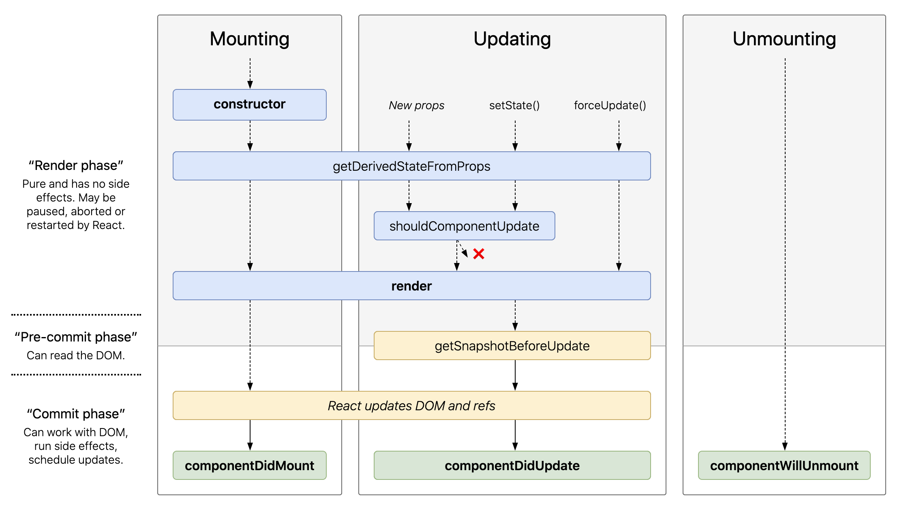
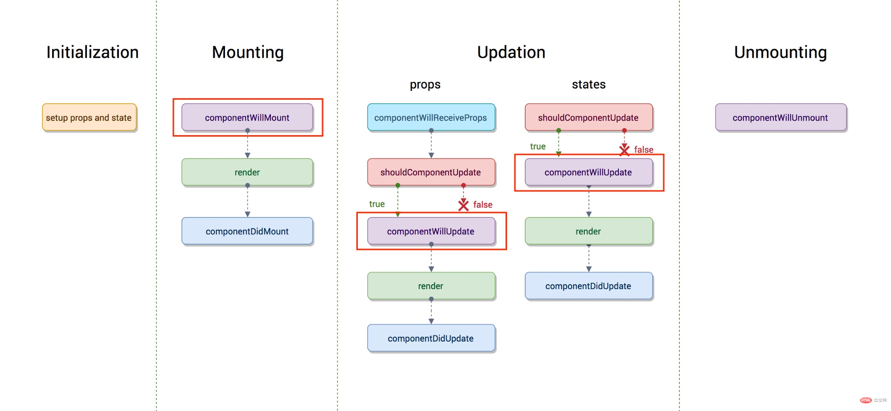

# React 生命周期
[React生命周期图谱](https://projects.wojtekmaj.pl/react-lifecycle-methods-diagram/)

以下图示的 React version >= 16.4



## 挂载
当组件实例被创建并插入 DOM 中时，其生命周期调用顺序如下：

### constructor
- 初始化 state
- 对自定义方法绑定 this -> React 的合成事件机制，使得调用事件时并不是 `instance.xxx`，而是将事件收集起来分别注册，事件处理函数会被放在数组里，再去遍历执行。

### static getDerivedStateFromProps
```js
static getDerivedStateFromProps(props, state)
```

它应返回一个对象来更新 state，如果返回 null 则不更新任何内容。

- 静态方法，所以无法获取到 this，也就意味着不能去执行一些副作用。此方法适用于罕见的用例，即 state 的值在任何时候都取决于 props。在以下场景中被调用：
  - 挂载
  - 父组件传入的 props 变化
  - 组件调用 setState
  - forceUpdate
- 接收 nextProps 与 prevState，即你可以使用新的 props 与当前 state 来调整新的组件状态，返回的对象会被交给 setState 进行更新，如果不需要可以返回 null。
- 注意，在这里没有实例的 this，因此你不能 `this.props.xxx !== nextProps.xxx`，而是需要在 state 里保存上一个 props，官方的解释是，这个方法在第一次调用时 prevProps 为 null，那么就需要每次判断，对性能有影响。

### componentWillMount （已废弃）
- 在组件挂载（即 render 方法）之前被调用，所以在这里去执行 setState 不会引起额外的渲染。
- 不要在这里发起 Ajax 请求，首先，无论数据多快返回，都是在 render 后才会返回的。
- 这个生命周期是唯一会在 SSR 中被触发的，因此更不应该将 Ajax 请求或是异步 I/O 放在这里了。基于这些理由，请求数据更应该放在 DidMount 中。
- 如果在这里添加事件监听器或是订阅，componentWillUnmount 并不会确保被触发（如 SSR 中永远不会调用 unmount），只有在 componentDidMount 中绑定，React 才会确保 unmount 被调用。
- 尤其是在引入了 Fiber 架构后，这个生命周期在 render 之前，因此有可能被打断然后多次调用。

### render
- 核心方法，Class 组件中必须实现

- 当执行到这里，render 会检查 props 与 state，返回：

  - React 元素
  - 数组或 fragments
  - Portals
  - 字符串或数值类型
  - 布尔值或 null...

- render 函数应当只负责返回渲染内容，业务逻辑/数据请求应当使用别的生命周期来处理，如 DidMount 和 DidUpdate

### componentDidMount

- 在组件挂载入 DOM 树后被调用，需要使用 DOM 节点的初始化方法以及网络请求都应该放在这里。
- 这里同样适用于添加订阅/监听，理由请参考上面。但是请记得在 unmount 里取消掉
- 在这里调用 setState 虽然会触发额外的渲染，但是会发生在屏幕被更新前，即用户不会看到更新状态。可以这么理解，挂载 -> mount -> didmount 更新 -> 渲染更新后的 DOM。这里可能涉及到 requestIdleCallback 的知识？

为什么数据获取要在 `componentDidMount`？ 而不是 `componentWillMount`？

## 更新
### componentWillReceiveProps （已废弃）
- 父组件传入 props 变动导致更新时，子组件并不一定需要进行更新，这个方法接收 prevProps 与 nextProps，并可以在其中 setState 更新状态来响应更新。
- 当父组件导致子组件重新渲染，即使 props 没有改变也会使得此方法被调用，因此需要进行 prev 与 next 值的比较，来确保其只在 props 更新时执行。
- 这个方法可能在一次更新中被调用多次（如存在副作用的情况）。
- 使用 `componentDidUpdate`，确保每次更新只会调用一次，或是使用 `getDerivedStateFromProps` 与 `componentDidUpdate` 一同取代掉它。

### static getDerivedStateFromProps

### shouldComponentUpdate
```js
shouldComponentUpdate(nextProps, nextState)
```

- 这个方法接收 nextProps 与 nextState，返回 true/false，并指示组件是否重新渲染
- 通常我们会把前后 props 与 state 分别进行比对，来减少重渲染以提高性能
- 官方提供的 PureComponent 在内部实现了 props 与 state 浅层比较（基于 shallowEuqal，可以去源码里看看这个方法）
- 首次渲染与 forceUpdate 并不会触发此方法
- 如果这个方法返回 false，那么就不会触发接下来的 WillUpdate & render & DidUpdate
- 官方提到在后续版本里，React 可能会将这个方法的返回值视为是否重渲染的参考而非指令，即有可能返回 false，但 React 认为有重渲染的必要，因而还是会进行重渲染。

### componentWillUpdate （已废弃）

### render
### static getSnapshotBeforeUpdate
```js
getSnapshotBeforeUpdate(prevProps, prevState)
```

- 这个方法接收 prevProps 与 prevState，计算并返回 snapshot，在其中你可以获取到 DOM 信息。
- 它的执行时机是十分有用的，在 render 后，而在更新 DOM 之前才被调用，你可以确保在这里获取到的 DOM 信息是准确无误的。
- 这个方法返回的 snapshot 会被传入给 componentDidUpdate 并作为它的第三个参数，注意，即使你不想返回值，也请返回 null。并且这个方法必须和 DidUpdate 一同使用。
- snapshot 并不一定是 DOM 结构或是组件快照，它也可以是任何值。

### componentDidUpdate
```js
componentDidUpdate(prevProps, prevState, snapshot)
```

- 接收 `prevProps` `prevState` `snapshot`，会在更新后立刻被调用，但首次渲染不会被执行。
- 可用于操作 DOM、发起请求、setState，但一定要使用 if 语句控制如 `if(this.props.xxx !== prevProps.xxx)`。

## 卸载
### componentWillUnmount
- 会在组件卸载及销毁之前直接调用。在此方法中执行必要的清理操作，例如，清除 timer，取消网络请求或清除在 `componentDidMount()` 中创建的订阅等。

- `componentWillUnmount()` 中不应调用 setState()，因为该组件将永远不会重新渲染。组件实例卸载后，将永远不会再挂载它。

## 错误相关
### static getDerivedStateFromError
```js
static getDerivedStateFromError(error)
```

- 此生命周期会在后代组件抛出错误后被调用。 它将抛出的错误作为参数，并返回一个值以更新 state。
- 会在渲染阶段调用，因此不允许出现副作用。如遇此类情况，改用 `componentDidCatch()`。
- 可以在最外层使用 ErrorBoundary 组件，并基于这个方法来处理报错时的渲染。

### componentDidCatch
```js
componentDidCatch(error, info)
```

- 此生命周期在后代组件抛出错误后被调用，接收 error info 参数，抛出的错误与组件错误栈信息。
- 会在“提交”阶段被调用，因此允许执行副作用。 它应该用于记录错误之类的情况。

# 相关问题
原生命周期图谱：

## 为什么数据获取要在 componentDidMount 中进行?
首先，分析一下两者请求数据的区别：

`componentWillMount` 获取数据：

1. 执行willMount函数，等待数据返回
2. 执行render函数
3. 执行didMount函数
4. 数据返回， 执行render

`componentDidMount` 获取数据：

1. 执行willMount函数
2. 执行render函数
3. 执行didMount函数， 等待数据返回
4. 数据返回， 执行render

很明显，在 `componentWillMount` 中获取数据，可以节省时间（`render` 函数和 `componentDidMount` 函数的执行时间），但是为什么我们还要在 `componentDidMount` 中获取数据？

1. 如果使用服务端渲染的话， `willMount` 会在服务端和客户端各自执行一次，这会导致请求两次（接受不了），而 `didMount` 只会在客户端进行
2. 在 `Fiber` 之后， 由于任务可中断， `willMount` 可能会被执行多次( `fiber` 算法是异步渲染，异步的渲染，很可能因为高优先级任务的出现而打断现有任务导致 `componentWillMount` 就可能执行多次)
3. 节省的时间非常少，跟其他的延迟情况相比，这个优化可以使用九牛一毛的形容（为了这么一点时间而一直不跟进技术的发展，得不偿失），并且 `render` 函数是肯定比异步数据到达先执行，白屏时间并不能减少

关于第一点，如果你想在服务端渲染时先完成数据的展示再一次性给用户，官方的推荐做法是用 `constructor` 代替 `willMount`。

## 为什么要废弃那几个生命周期？
废弃的生命周期：
- componentWillMount()
- componentWillUpdate()
- componentWillReceiveProps()

1. 被废弃的三个函数都是在render之前，fiber 的出现很可能因为高优先级任务的出现而打断现有任务导致它们会被执行多次
2. 约束开发者，不写有副作用的函数

## 为什么新增的生命周期是静态方法?
新的生命周期增加了
- static getDerivedStateFromProps()
- getSnapshotBeforeUpdate()

静态方法不能使用 this，也就是一个纯函数，开发者不能写出有副作用的代码。


# 参考链接
[为什么废弃react生命周期函数？](https://segmentfault.com/a/1190000021272657)
[React 16.4 生命周期详解](https://linbudu.top/posts/2020/06/29/react-life-cycle.html)